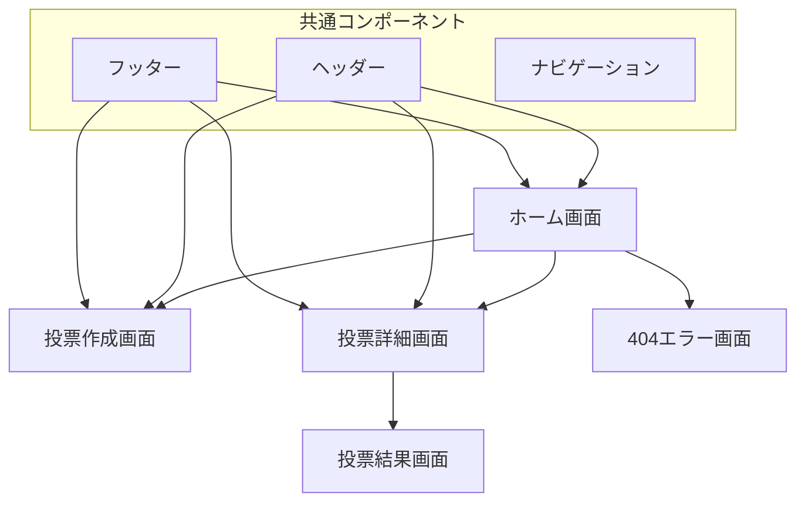
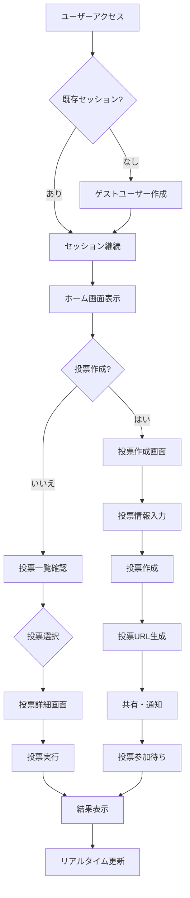
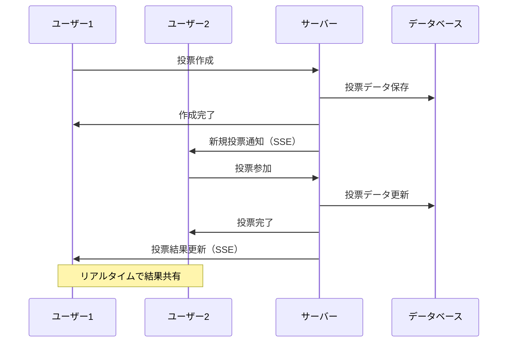

# VoteNow 機能仕様書

## 📋 目次

1. [プロジェクト概要](#プロジェクト概要)
2. [機能一覧](#機能一覧)
3. [画面仕様](#画面仕様)
4. [業務フロー](#業務フロー)
5. [非機能要件](#非機能要件)

---

## プロジェクト概要

VoteNowは、リアルタイム投票機能を備えたモダンなWeb投票プラットフォームです。ユーザーは簡単に投票を作成・参加でき、結果をリアルタイムで確認できます。

### プロダクトビジョン

**「誰でも簡単に、リアルタイムで意見を集められる投票プラットフォーム」**

### 主要特徴

- **簡単操作**: ユーザー登録不要で即座に利用開始
- **リアルタイム**: 投票結果の即座反映と可視化
- **多様性**: 単一選択・複数選択など柔軟な投票形式
- **共有性**: 簡単な共有機能で広範囲な参加を促進
- **アクセシビリティ**: モバイル・デスクトップ全対応

### ターゲットユーザー

| ユーザー層 | 利用シーン | ニーズ |
|-----------|-----------|--------|
| 企業・チーム | 会議での意思決定、アンケート | 迅速な合意形成、全員参加 |
| 教育機関 | 授業での質問、学生投票 | リアルタイム参加、匿名性 |
| イベント主催者 | 参加者アンケート、選択投票 | 大規模参加、結果の可視化 |
| 個人ユーザー | 友人間の決定、趣味投票 | 手軽さ、共有のしやすさ |

---

## 機能一覧

### 投票管理機能

#### 投票作成機能

| 機能項目 | 説明 | 詳細 | 対応状況 |
|---------|------|------|----------|
| 基本情報設定 | 投票のタイトルと説明 | 必須：タイトル（最大100文字）<br>任意：説明（最大500文字） | ✅ |
| カテゴリ選択 | 投票の分類 | general, work, event, poll, other | ✅ |
| 選択肢設定 | 投票選択肢の定義 | 最小2個、最大10個<br>選択肢ごとに説明追加可能 | ✅ |
| 投票方式設定 | 単一・複数選択の選択 | 単一選択：1つのみ選択可能<br>複数選択：複数選択可能 | ✅ |
| 公開設定 | 投票の公開範囲 | 公開：誰でもアクセス可能<br>限定：URLを知る人のみ | ✅ |
| 期限設定 | 投票の有効期限 | 未設定時：自動で1週間後<br>手動設定：任意の日時 | ✅ |

#### 投票一覧・検索機能

| 機能項目 | 説明 | 詳細 | 対応状況 |
|---------|------|------|----------|
| 投票一覧表示 | 作成された投票の一覧 | カード形式で表示<br>ページネーション対応 | ✅ |
| カテゴリフィルタ | カテゴリによる絞り込み | すべて/一般/仕事/イベント/投票/その他 | ✅ |
| ステータスフィルタ | 投票状態による絞り込み | すべて/アクティブ/終了済み | ✅ |
| 検索機能 | キーワードによる検索 | タイトル・説明文での部分一致検索 | ✅ |
| ソート機能 | 並び順の変更 | 作成日時（新しい順/古い順）<br>投票数（多い順/少ない順） | ✅ |

### 投票参加機能

#### 投票実行機能

| 機能項目 | 説明 | 詳細 | 対応状況 |
|---------|------|------|----------|
| 投票フォーム | 選択肢からの投票 | 単一選択：ラジオボタン<br>複数選択：チェックボックス | ✅ |
| 投票確認 | 投票前の確認ダイアログ | 選択内容の確認<br>投票後の変更不可説明 | ✅ |
| 重複投票防止 | 同一ユーザーの重複防止 | セッションベースでの制御<br>投票済み表示 | ✅ |
| 投票結果表示 | リアルタイム結果表示 | 円グラフ・棒グラフ<br>パーセンテージ表示 | ✅ |

#### 結果表示機能

| 機能項目 | 説明 | 詳細 | 対応状況 |
|---------|------|------|----------|
| チャート表示 | 視覚的な結果表示 | 円グラフ：割合表示<br>棒グラフ：比較表示 | ✅ |
| 統計情報 | 投票の統計データ | 総投票数、各選択肢の得票数・割合 | ✅ |
| リアルタイム更新 | 結果の即座反映 | SSEによる自動更新<br>アニメーション付き変更 | ✅ |
| 投票履歴 | ユーザーの投票履歴 | 投票日時、選択した内容の表示 | ✅ |

### ユーザー管理機能

#### ゲストユーザー機能

| 機能項目 | 説明 | 詳細 | 対応状況 |
|---------|------|------|----------|
| 自動ユーザー作成 | セッションベースユーザー | セッション開始時に自動作成<br>Guest-{8文字ID}形式 | ✅ |
| セッション管理 | ユーザー状態の維持 | 7日間有効なセッション<br>暗号化Cookie使用 | ✅ |
| 匿名参加 | 個人情報不要での参加 | メールアドレス等の入力不要<br>プライバシー保護 | ✅ |

### 共有機能

#### 投票共有機能

| 機能項目 | 説明 | 詳細 | 対応状況 |
|---------|------|------|----------|
| URL共有 | 投票URLの共有 | 直接URL取得<br>QRコード生成（予定） | ✅ |
| Web Share API | ネイティブ共有 | 対応ブラウザでのネイティブ共有 | ✅ |
| クリップボードコピー | URL一括コピー | ワンクリックでURLコピー | ✅ |

### リアルタイム機能

#### リアルタイム更新機能

| 機能項目 | 説明 | 詳細 | 対応状況 |
|---------|------|------|----------|
| 結果リアルタイム表示 | 投票結果の即座反映 | SSEによる自動更新<br>1秒以内の反映 | ✅ |
| 接続状態表示 | 接続ステータスの可視化 | 接続中/切断中の表示<br>再接続進行状況 | ✅ |
| 自動再接続 | 接続断時の自動復旧 | 最大5回の再試行<br>指数バックオフ | ✅ |
| 新規投票通知 | 新しい投票の通知 | リアルタイムでの新規投票表示 | ✅ |

---

## 画面仕様

### 画面構成



### 画面詳細仕様

#### ホーム画面（/）

**目的**: 投票一覧の表示と全体統計の確認

| セクション | 内容 | 機能 |
|-----------|------|------|
| ヘッダー | ロゴ、ナビゲーション | 投票作成ボタン、テーマ切り替え |
| 統計カード | 全体統計表示 | 総投票数、アクティブ投票数、今日の投票数 |
| フィルター | 絞り込み機能 | カテゴリ、ステータス、検索フィールド |
| 投票一覧 | 投票カード表示 | タイトル、説明、投票数、期限、参加ボタン |
| リアルタイムステータス | 接続状態 | オンライン状態、最終更新時刻 |

**レスポンシブ対応**:
- モバイル: 1カラム、縦積み表示
- タブレット: 2カラム、グリッド表示
- デスクトップ: 3カラム、サイドバー付き

#### 投票作成画面（/create）

**目的**: 新しい投票の作成

| セクション | 内容 | 機能 |
|-----------|------|------|
| 基本情報 | タイトル・説明入力 | リアルタイムバリデーション |
| カテゴリ選択 | 5つのカテゴリから選択 | ラジオボタン、アイコン付き |
| 選択肢設定 | 動的な選択肢追加 | 最大10個、削除・並び替え可能 |
| 設定オプション | 詳細設定 | 複数選択、公開設定、期限設定 |
| プレビュー | 投票プレビュー | 実際の表示イメージ確認 |
| 作成ボタン | 投票作成実行 | 確認ダイアログ表示 |

**バリデーション**:
- タイトル: 必須、1-100文字
- 説明: 任意、最大500文字
- 選択肢: 最小2個、最大10個

#### 投票詳細画面（/vote/[id]）

**目的**: 投票への参加と結果確認

| セクション | 内容 | 機能 |
|-----------|------|------|
| 投票情報 | タイトル、説明、作成者 | カテゴリバッジ、期限表示 |
| 投票フォーム | 選択肢一覧 | 単一/複数選択、説明表示 |
| 結果チャート | 視覚的結果表示 | 円グラフ・棒グラフ切り替え |
| 統計情報 | 詳細統計 | 総投票数、各選択肢の詳細 |
| 共有ボタン | 投票共有 | URL共有、SNS共有 |
| 投票履歴 | ユーザー履歴 | 投票日時、選択内容 |

**投票状態**:
- 未投票: 投票フォーム表示
- 投票済み: 結果表示、フォーム無効化
- 期限切れ: 結果表示のみ

### UIコンポーネント設計

#### 投票カード

```
┌─────────────────────────────────┐
│ [カテゴリバッジ]        [期限] │
│ 投票タイトル                    │
│ 投票の説明文...                 │
│ ──────────────────────────── │
│ 👥 123票 📊 [結果を見る]      │
└─────────────────────────────────┘
```

#### 結果チャート

```
円グラフ表示例:
    選択肢A (45%)
       ●●●●●
    選択肢B (30%)
       ●●●
    選択肢C (25%)
       ●●

棒グラフ表示例:
選択肢A ████████████████████ 45% (123票)
選択肢B ████████████         30% (82票)
選択肢C ██████████           25% (68票)
```

---

## 業務フロー

### 投票作成から結果確認までのフロー



### リアルタイム更新フロー



---

## 非機能要件

### パフォーマンス要件

| 項目 | 要件 | 測定方法 |
|------|------|----------|
| ページ読み込み時間 | 初回: 3秒以内<br>2回目以降: 1秒以内 | Lighthouse Core Web Vitals |
| APIレスポンス時間 | 95%が500ms以内 | サーバーログ分析 |
| リアルタイム更新遅延 | 1秒以内 | クライアント側測定 |
| 同時接続数 | 1,000ユーザー対応 | 負荷テスト |

### 可用性要件

| 項目 | 要件 | 対応策 |
|------|------|--------|
| システム稼働率 | 99.9%以上 | 冗長化、監視システム |
| 計画メンテナンス | 月1回、2時間以内 | 事前通知、段階的デプロイ |
| 障害復旧時間 | 1時間以内 | 自動復旧、アラート |

### セキュリティ要件

| 項目 | 要件 | 実装方法 |
|------|------|----------|
| データ保護 | 個人情報の最小収集 | 匿名投票、最小権限 |
| セッション保護 | セッション固定攻撃対策 | 暗号化Cookie、定期更新 |
| 入力検証 | XSS、SQLインジェクション対策 | 入力サニタイズ、ORM使用 |
| API保護 | レート制限 | IP別、ユーザー別制限 |

### ユーザビリティ要件

| 項目 | 要件 | 実装方法 |
|------|------|----------|
| アクセシビリティ | WCAG 2.1 AA準拠 | スクリーンリーダー対応 |
| モバイル対応 | 全画面でタッチ操作最適化 | レスポンシブデザイン |
| 国際化対応 | 日本語・英語対応（将来） | i18n実装準備 |

---

*最終更新: 2025-06-28*  
*バージョン: 1.0.0*  
*関連文書: [技術仕様書](./technical-specification.md), [ユーザーストーリー](./user-stories.md)*