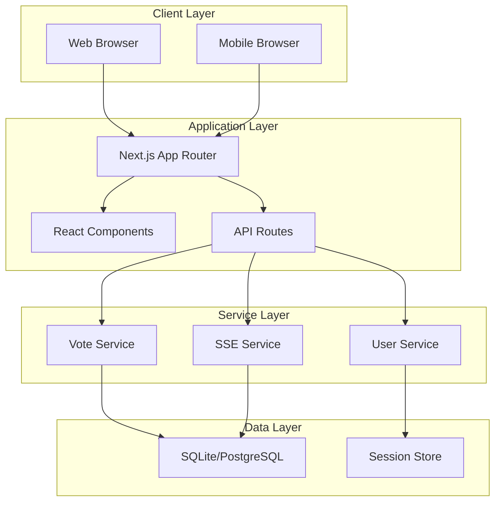
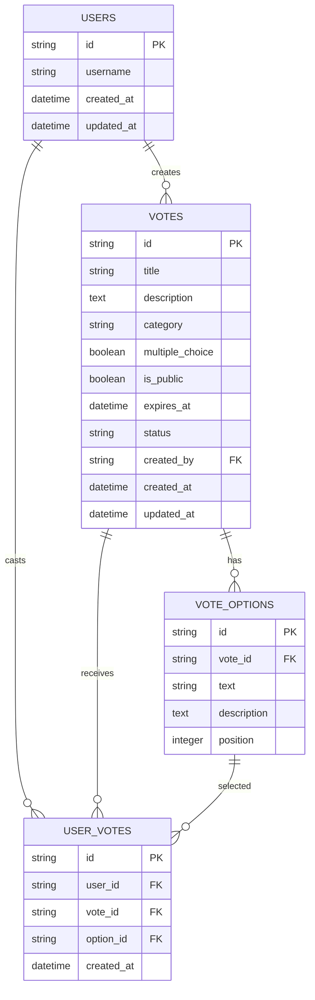

# VoteNow 技術仕様書

## 📋 目次

1. [システム概要](#システム概要)
2. [アーキテクチャ設計](#アーキテクチャ設計)
3. [技術スタック](#技術スタック)
4. [データベース設計](#データベース設計)
5. [API設計](#api設計)
6. [リアルタイム機能](#リアルタイム機能)
7. [セキュリティ仕様](#セキュリティ仕様)
8. [パフォーマンス最適化](#パフォーマンス最適化)
9. [デプロイメント](#デプロイメント)
10. [監視・ログ](#監視・ログ)

---

## システム概要

VoteNowは、Next.js 15 App Routerを使用したフルスタックWebアプリケーションで、リアルタイム投票機能を提供します。

### 主要技術特徴

- **フロントエンド**: React 18 + TypeScript + Tailwind CSS
- **バックエンド**: Next.js API Routes + TypeScript
- **データベース**: SQLite (開発) / PostgreSQL (本番)
- **リアルタイム**: Server-Sent Events (SSE)
- **セッション管理**: 暗号化Cookie
- **認証**: セッションベース (ゲストユーザー)

---

## アーキテクチャ設計

### システム構成図



### ディレクトリ構造

```
src/
├── app/                    # Next.js App Router
│   ├── (routes)/          # ルート定義
│   ├── api/               # API Routes
│   └── globals.css        # グローバルスタイル
├── components/            # Reactコンポーネント
│   ├── ui/               # shadcn/ui基本コンポーネント
│   ├── layout/           # レイアウトコンポーネント
│   ├── vote/             # 投票関連コンポーネント
│   └── charts/           # チャート関連コンポーネント
├── lib/                  # ユーティリティ・設定
│   ├── db/              # データベース関連
│   ├── auth/            # 認証関連
│   ├── utils/           # ユーティリティ関数
│   └── types/           # TypeScript型定義
├── hooks/               # カスタムフック
└── styles/              # スタイル関連
```

---

## 技術スタック

### フロントエンド

| 技術 | バージョン | 用途 | 理由 |
|------|------------|------|------|
| Next.js | 15.3.2 | フレームワーク | App Router、SSR、API Routes |
| React | 18.x | UIライブラリ | 最新機能、並行レンダリング |
| TypeScript | 5.x | 型安全性 | 開発効率、バグ防止 |
| Tailwind CSS | 4.x | CSSフレームワーク | 高速開発、一貫性 |
| shadcn/ui | 最新 | UIコンポーネント | 品質、カスタマイズ性 |
| Lucide React | 最新 | アイコン | 軽量、一貫性 |

### バックエンド・インフラ

| 技術 | バージョン | 用途 | 理由 |
|------|------------|------|------|
| Node.js | 20.x LTS | ランタイム | 安定性、パフォーマンス |
| SQLite | 3.x | 開発DB | 簡単セットアップ |
| PostgreSQL | 15.x | 本番DB | スケーラビリティ |
| Prisma | 5.x | ORM | 型安全、マイグレーション |

### 開発ツール

| 技術 | バージョン | 用途 |
|------|------------|------|
| ESLint | 8.x | コード品質 |
| Prettier | 3.x | コードフォーマット |
| Husky | 8.x | Git hooks |
| Jest | 29.x | テストフレームワーク |

---

## データベース設計

### ERダイアグラム



### テーブル詳細仕様

#### users テーブル
```sql
CREATE TABLE users (
    id TEXT PRIMARY KEY,
    username TEXT NOT NULL,
    created_at DATETIME NOT NULL DEFAULT CURRENT_TIMESTAMP,
    updated_at DATETIME NOT NULL DEFAULT CURRENT_TIMESTAMP
);
```

#### votes テーブル
```sql
CREATE TABLE votes (
    id TEXT PRIMARY KEY,
    title TEXT NOT NULL,
    description TEXT,
    category TEXT NOT NULL CHECK (category IN ('general', 'work', 'event', 'poll', 'other')),
    multiple_choice BOOLEAN NOT NULL DEFAULT 0,
    is_public BOOLEAN NOT NULL DEFAULT 1,
    expires_at DATETIME,
    status TEXT NOT NULL DEFAULT 'active' CHECK (status IN ('active', 'closed')),
    created_by TEXT NOT NULL,
    created_at DATETIME NOT NULL DEFAULT CURRENT_TIMESTAMP,
    updated_at DATETIME NOT NULL DEFAULT CURRENT_TIMESTAMP,
    FOREIGN KEY (created_by) REFERENCES users(id)
);
```

#### vote_options テーブル
```sql
CREATE TABLE vote_options (
    id TEXT PRIMARY KEY,
    vote_id TEXT NOT NULL,
    text TEXT NOT NULL,
    description TEXT,
    position INTEGER NOT NULL,
    FOREIGN KEY (vote_id) REFERENCES votes(id) ON DELETE CASCADE
);
```

#### user_votes テーブル
```sql
CREATE TABLE user_votes (
    id TEXT PRIMARY KEY,
    user_id TEXT NOT NULL,
    vote_id TEXT NOT NULL,
    option_id TEXT NOT NULL,
    created_at DATETIME NOT NULL DEFAULT CURRENT_TIMESTAMP,
    FOREIGN KEY (user_id) REFERENCES users(id),
    FOREIGN KEY (vote_id) REFERENCES votes(id) ON DELETE CASCADE,
    FOREIGN KEY (option_id) REFERENCES vote_options(id) ON DELETE CASCADE,
    UNIQUE(user_id, vote_id, option_id)
);
```

### インデックス設計

```sql
-- 投票一覧表示の高速化
CREATE INDEX idx_votes_created_at ON votes(created_at DESC);
CREATE INDEX idx_votes_category ON votes(category);
CREATE INDEX idx_votes_status ON votes(status);

-- 投票結果集計の高速化
CREATE INDEX idx_user_votes_vote_id ON user_votes(vote_id);
CREATE INDEX idx_user_votes_option_id ON user_votes(option_id);

-- ユーザー投票履歴の高速化
CREATE INDEX idx_user_votes_user_id ON user_votes(user_id);
```

---

## API設計

### RESTful API仕様

#### 投票関連API

| エンドポイント | メソッド | 説明 | レスポンス |
|---------------|----------|------|------------|
| `/api/votes` | GET | 投票一覧取得 | `Vote[]` |
| `/api/votes` | POST | 投票作成 | `Vote` |
| `/api/votes/[id]` | GET | 投票詳細取得 | `Vote` |
| `/api/votes/[id]/vote` | POST | 投票実行 | `VoteResult` |
| `/api/votes/[id]/results` | GET | 投票結果取得 | `VoteResult` |

#### リアルタイム関連API

| エンドポイント | メソッド | 説明 |
|---------------|----------|------|
| `/api/sse/votes` | GET | 投票更新SSE |
| `/api/sse/results/[id]` | GET | 結果更新SSE |

### データ型定義

```typescript
// 基本型
export interface User {
  id: string;
  username: string;
  created_at: string;
  updated_at: string;
}

export interface Vote {
  id: string;
  title: string;
  description?: string;
  category: 'general' | 'work' | 'event' | 'poll' | 'other';
  multiple_choice: boolean;
  is_public: boolean;
  expires_at?: string;
  status: 'active' | 'closed';
  created_by: string;
  created_at: string;
  updated_at: string;
  options: VoteOption[];
}

export interface VoteOption {
  id: string;
  vote_id: string;
  text: string;
  description?: string;
  position: number;
}

export interface UserVote {
  id: string;
  user_id: string;
  vote_id: string;
  option_id: string;
  created_at: string;
}

// API レスポンス型
export interface VoteResult {
  vote: Vote;
  results: {
    option_id: string;
    count: number;
    percentage: number;
  }[];
  total_votes: number;
  user_vote?: UserVote[];
}

export interface VoteListResponse {
  votes: Vote[];
  pagination: {
    page: number;
    limit: number;
    total: number;
    has_next: boolean;
  };
}
```

### エラーハンドリング

```typescript
export interface ApiError {
  error: string;
  message: string;
  status: number;
  timestamp: string;
}

// HTTP ステータスコード
// 200: 成功
// 201: 作成成功
// 400: 無効なリクエスト
// 401: 認証エラー
// 403: 権限エラー
// 404: リソースが見つからない
// 409: 重複エラー
// 429: レート制限
// 500: サーバーエラー
```

---

## リアルタイム機能

### Server-Sent Events (SSE) 実装

#### 接続管理

```typescript
// lib/sse/connection-manager.ts
export class SSEConnectionManager {
  private connections = new Map<string, Response>();
  
  addConnection(id: string, response: Response): void;
  removeConnection(id: string): void;
  broadcast(data: any): void;
  broadcastToVote(voteId: string, data: any): void;
}
```

#### イベント種類

| イベント種類 | 説明 | データ形式 |
|-------------|------|------------|
| `vote-created` | 新規投票作成 | `Vote` |
| `vote-updated` | 投票更新 | `Vote` |
| `result-updated` | 結果更新 | `VoteResult` |
| `connection-status` | 接続状態 | `{status: string}` |

#### フロントエンド実装

```typescript
// hooks/use-sse.ts
export function useSSE(endpoint: string) {
  const [data, setData] = useState(null);
  const [status, setStatus] = useState<'connecting' | 'connected' | 'disconnected'>('connecting');
  
  useEffect(() => {
    const eventSource = new EventSource(endpoint);
    
    eventSource.onopen = () => setStatus('connected');
    eventSource.onmessage = (event) => setData(JSON.parse(event.data));
    eventSource.onerror = () => setStatus('disconnected');
    
    return () => eventSource.close();
  }, [endpoint]);
  
  return { data, status };
}
```

---

## セキュリティ仕様

### 認証・認可

#### セッション管理

```typescript
// lib/auth/session.ts
export interface SessionData {
  userId: string;
  username: string;
  createdAt: number;
  expiresAt: number;
}

export class SessionManager {
  private readonly secretKey: string;
  private readonly maxAge: number = 7 * 24 * 60 * 60 * 1000; // 7日
  
  async createSession(userId: string): Promise<string>;
  async validateSession(token: string): Promise<SessionData | null>;
  async refreshSession(token: string): Promise<string>;
  async destroySession(token: string): Promise<void>;
}
```

#### 入力検証

```typescript
// lib/validation/schemas.ts
import { z } from 'zod';

export const createVoteSchema = z.object({
  title: z.string().min(1).max(100),
  description: z.string().max(500).optional(),
  category: z.enum(['general', 'work', 'event', 'poll', 'other']),
  options: z.array(z.string().min(1).max(200)).min(2).max(10),
  multiple_choice: z.boolean(),
  is_public: z.boolean(),
  expires_at: z.string().datetime().optional(),
});

export const castVoteSchema = z.object({
  option_ids: z.array(z.string()).min(1).max(10),
});
```

### セキュリティヘッダー

```typescript
// next.config.js
const nextConfig = {
  async headers() {
    return [
      {
        source: '/(.*)',
        headers: [
          {
            key: 'X-Frame-Options',
            value: 'DENY',
          },
          {
            key: 'X-Content-Type-Options',
            value: 'nosniff',
          },
          {
            key: 'Referrer-Policy',
            value: 'strict-origin-when-cross-origin',
          },
          {
            key: 'Content-Security-Policy',
            value: "default-src 'self'; script-src 'self' 'unsafe-eval'; style-src 'self' 'unsafe-inline';",
          },
        ],
      },
    ];
  },
};
```

### レート制限

```typescript
// lib/rate-limit/limiter.ts
export class RateLimiter {
  private readonly redis: Redis;
  
  async checkLimit(
    key: string,
    limit: number,
    window: number
  ): Promise<{ allowed: boolean; remaining: number; resetTime: number }>;
}

// API Routes での使用例
export async function POST(request: Request) {
  const ip = request.headers.get('x-forwarded-for') || 'unknown';
  const { allowed } = await rateLimiter.checkLimit(`vote:${ip}`, 10, 60000);
  
  if (!allowed) {
    return Response.json({ error: 'Too many requests' }, { status: 429 });
  }
  
  // 処理続行
}
```

---

## パフォーマンス最適化

### フロントエンド最適化

#### Code Splitting
```typescript
// app/vote/[id]/page.tsx
import dynamic from 'next/dynamic';

const VoteChart = dynamic(() => import('@/components/charts/vote-chart'), {
  loading: () => <div>チャート読み込み中...</div>,
  ssr: false,
});
```

#### メモ化戦略
```typescript
// components/vote/vote-list.tsx
import { memo, useMemo } from 'react';

export const VoteList = memo(({ votes, filters }: VoteListProps) => {
  const filteredVotes = useMemo(() => {
    return votes.filter(vote => {
      if (filters.category && vote.category !== filters.category) return false;
      if (filters.status && vote.status !== filters.status) return false;
      return true;
    });
  }, [votes, filters]);
  
  return (
    <div>
      {filteredVotes.map(vote => <VoteCard key={vote.id} vote={vote} />)}
    </div>
  );
});
```

### バックエンド最適化

#### データベースクエリ最適化
```typescript
// lib/db/vote-repository.ts
export class VoteRepository {
  async getVotesWithResults(filters: VoteFilters) {
    return await db.vote.findMany({
      where: {
        AND: [
          filters.category ? { category: filters.category } : {},
          filters.status ? { status: filters.status } : {},
        ],
      },
      include: {
        options: {
          include: {
            _count: {
              select: { user_votes: true },
            },
          },
        },
        _count: {
          select: { user_votes: true },
        },
      },
      orderBy: { created_at: 'desc' },
      take: filters.limit,
      skip: filters.offset,
    });
  }
}
```

#### キャッシュ戦略
```typescript
// lib/cache/vote-cache.ts
export class VoteCache {
  private readonly redis: Redis;
  private readonly ttl = 300; // 5分
  
  async getVoteResults(voteId: string): Promise<VoteResult | null> {
    const cached = await this.redis.get(`vote:results:${voteId}`);
    return cached ? JSON.parse(cached) : null;
  }
  
  async setVoteResults(voteId: string, results: VoteResult): Promise<void> {
    await this.redis.setex(
      `vote:results:${voteId}`,
      this.ttl,
      JSON.stringify(results)
    );
  }
}
```

---

## デプロイメント

### 本番環境構成

```yaml
# docker-compose.prod.yml
version: '3.8'
services:
  app:
    build: .
    environment:
      - NODE_ENV=production
      - DATABASE_URL=postgresql://user:pass@db:5432/votenow
    depends_on:
      - db
      - redis
  
  db:
    image: postgres:15
    environment:
      POSTGRES_DB: votenow
      POSTGRES_USER: user
      POSTGRES_PASSWORD: pass
    volumes:
      - postgres_data:/var/lib/postgresql/data
  
  redis:
    image: redis:7-alpine
    volumes:
      - redis_data:/data
  
  nginx:
    image: nginx:alpine
    ports:
      - "80:80"
      - "443:443"
    volumes:
      - ./nginx.conf:/etc/nginx/nginx.conf
```

### CI/CD パイプライン

```yaml
# .github/workflows/deploy.yml
name: Deploy to Production

on:
  push:
    branches: [main]

jobs:
  test:
    runs-on: ubuntu-latest
    steps:
      - uses: actions/checkout@v4
      - uses: actions/setup-node@v4
        with:
          node-version: '20'
      - run: npm ci
      - run: npm run test
      - run: npm run build

  deploy:
    needs: test
    runs-on: ubuntu-latest
    steps:
      - uses: actions/checkout@v4
      - name: Deploy to server
        run: |
          docker-compose -f docker-compose.prod.yml up -d
```

---

## 監視・ログ

### ログ設計

```typescript
// lib/logger/index.ts
export enum LogLevel {
  ERROR = 'error',
  WARN = 'warn',
  INFO = 'info',
  DEBUG = 'debug',
}

export interface LogEntry {
  timestamp: string;
  level: LogLevel;
  message: string;
  metadata?: Record<string, any>;
  trace_id?: string;
}

export class Logger {
  log(level: LogLevel, message: string, metadata?: Record<string, any>): void;
  error(message: string, error?: Error): void;
  warn(message: string, metadata?: Record<string, any>): void;
  info(message: string, metadata?: Record<string, any>): void;
  debug(message: string, metadata?: Record<string, any>): void;
}
```

### メトリクス収集

```typescript
// lib/metrics/collector.ts
export class MetricsCollector {
  // API レスポンス時間
  recordApiResponseTime(endpoint: string, duration: number): void;
  
  // 投票作成数
  incrementVoteCreated(category: string): void;
  
  // 投票参加数
  incrementVoteParticipation(voteId: string): void;
  
  // SSE 接続数
  recordSSEConnections(count: number): void;
  
  // エラー発生数
  incrementError(type: string, endpoint?: string): void;
}
```

### ヘルスチェック

```typescript
// app/api/health/route.ts
export async function GET() {
  const health = {
    status: 'ok',
    timestamp: new Date().toISOString(),
    services: {
      database: await checkDatabase(),
      redis: await checkRedis(),
    },
  };
  
  const status = Object.values(health.services).every(s => s === 'ok') ? 200 : 503;
  return Response.json(health, { status });
}
```

---

*最終更新: 2025-06-28*  
*バージョン: 1.0.0*  
*関連文書: [機能仕様書](./functional-specification.md), [ユーザーストーリー](./user-stories.md)*